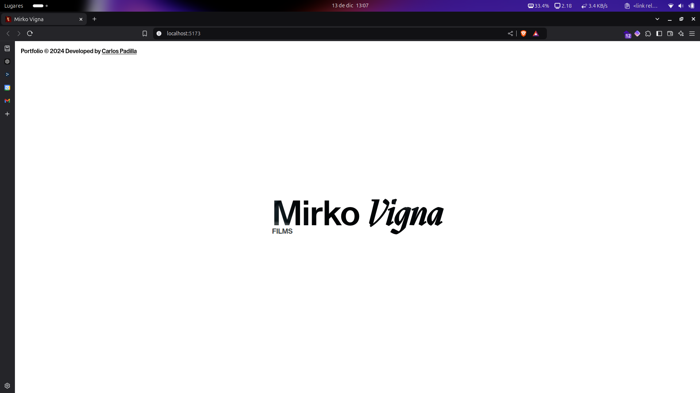
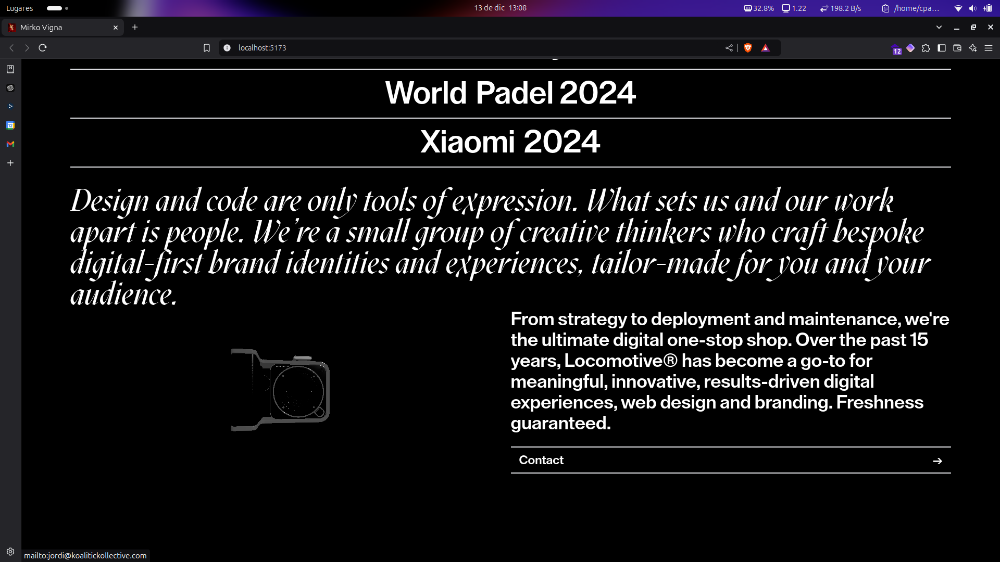
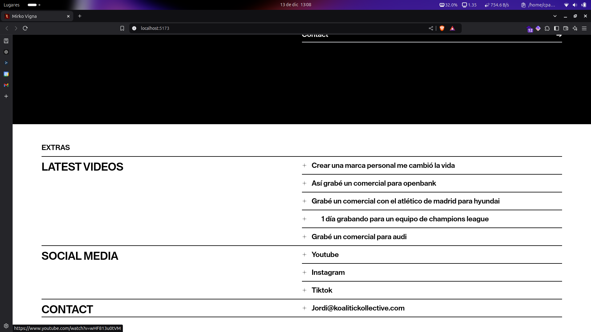
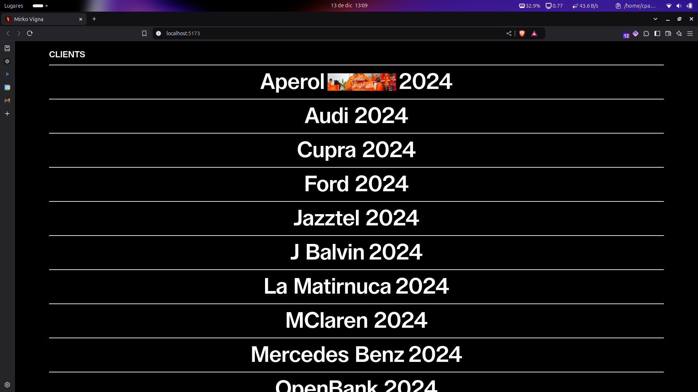

# Mirko Vigna PortFolio 2024

**Carlos Padilla - Spec Work**

Live demo: [Codepen/cpadlab](https://codepen.io/cpadlab)

## Requirements

- [NodeJS](https://nodejs.org/en/)
- [Framer Motion](https://jquery.com/)
- [GSAP](https://gsap.com/)
- [TailwindCSS](https://jqueryui.com/)
- [React](https://jquery.com/)

> [!NOTE]  
> You can find a pre-built in version in the /dist directory

## Install

```bash
git clone https://github.com/cpadlab/Mirko-Vigna-Portfolio
cd Mirko-Vigna-Portfolio && npm run dev
```

## Gallery






